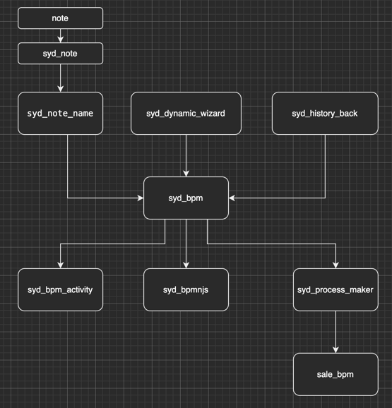
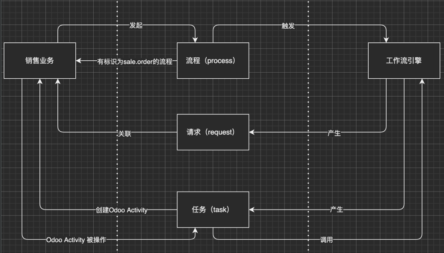

# ODOO链接ProcessMaker

B.P.M. 将 <a href="http://www.odoo.com">Odoo</a> 与 <a href="https://www.processmaker.com/">ProcessMaker</a> (4)进行了对接。

本仓库用于Odoo的14、16版本，因为重构所以不再fork之前的仓库。

[<a target='_blank' href="https://baijiahao.baidu.com/builder/preview/s?id=1747820665361723046">使用说明文字版</a>]

[<a target='_blank' href="https://www.bilibili.com/video/BV1tW4y1j7Xa/?spm_id_from=333.999.0.0&vd_source=5d5575c128394d478b50c2ecfa9a5df4">使用说明视频版</a>]

开发计划，见Issues。

贡献：

[<a href="https://github.com/feitas">乐川</a>] | [<a href="https://github.com/granzonchen">银枫</a>]

# 如何开发

Odoo与PM之间的过程关系图

